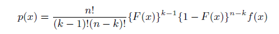

\tableofcontents 


```{r setup, include=FALSE}
knitr::opts_chunk$set(echo = TRUE)
pacman::p_load(readxl, tidyverse, fitdistrplus, KScorrect, betafunctions,ggpubr,readxl)
```

# 4.25 
Suppose $U_1, . . . , U_n$ are an iid sample from the standard uniform
distribution, and let $U_{(1)}, . . . , U_{(n)}$ be the order statistics. Investigate the approximation:   
median$\{U_{i}\} \approx \frac{i-1/3}{n+1/3}$  
for n = 5 and n = 10 *Hint: use the distribution of the order statistics in Exercise 2.4.* 

N(x) the number of sample values less than x
is binomial with parameters n and probability p = F(x)
$P(X_{(k)} <= x) = P\{N(x)>= k\}$


```{r}
n <- 5 
k <- round(n/2)
print("n = 5")
(n-(1/3))/(n+1/3)
(factorial(n)/(factorial(k-1)*factorial(n-k))) * (1/n)^(k-1) * (1-(1/n))^(n-k) * (1/n)


print("n = 10")
n <- 10 
k <- round(n/2)
(n-(1/3))/(n+1/3)
(factorial(n)/(factorial(k-1)*factorial(n-k))) * (1/n)^(k-1) * (1-(1/n))^(n-k) * (1/n)
```


# 4.27 

The following is the average amount of rainfall (in mm/hour)
per storm in a series of storms in Valencia, southwest Ireland. Data from two
months are reported below.


### a. Compare the summary statistics for the two months.
```{r}
jan <- c(0.15, 0.25, 0.10, 0.20, 1.85, 1.97, 0.80, 0.20, 0.10, 0.50, 0.82,
         0.40, 1.80, 0.20, 1.12, 1.83, 0.45, 3.17, 0.89, 0.31, 0.59, 0.10,
         0.10, 0.90, 0.10, 0.25, 0.10, 0.90)
jul <- c(0.30, 0.22, 0.10, 0.12, 0.20, 0.10, 0.10, 0.10, 0.10, 0.10, 0.10,
         0.17, 0.20, 2.80, 0.85, 0.10, 0.10, 1.23, 0.45, 0.30, 0.20, 1.20,
         0.10, 0.15, 0.10, 0.20, 0.10, 0.20, 0.35, 0.62, 0.20, 1.22, 0.30,
         0.80, 0.15, 1.53, 0.10, 0.20, 0.30, 0.40, 0.23, 0.20, 0.10, 0.10,
         0.60, 0.20, 0.50, 0.15, 0.60, 0.30, 0.80, 1.10, 0.20, 0.10, 0.10,
         0.10, 0.42, 0.85, 1.60, 0.10, 0.25, 0.10, 0.20, 0.10)
print("January")
summary(jan)
print("July")
summary(jul)
jan2 <- cbind(month = rep("jan", length(jan)), rain = jan)
jul2 <- cbind(month = rep("jul", length(jul)), rain = jul)
both <- data.frame(rbind(jan2, jul2)) %>% mutate(rain = as.numeric(rain))

stat_sum_df <- function(fun, geom="crossbar") {
  stat_summary(fun.data=fun, colour="red", geom=geom, width=0, size = 1)
}
ggplot(both, aes(x = month, y = rain))+
  geom_jitter(width = 0.3, height = 0, alpha = 0.25)+
  geom_violin(alpha = 0.0)+
  labs(x = "month", y = "mm/hr", title = "Distribution of Rainfall (mm/hr) with 95% CI of Mean")+
  stat_sum_df("mean_cl_normal", geom = "errorbar")

ggplot(both, aes(x = rain))+
  geom_histogram(aes(fill = month, y = ..density..), alpha = 0.3, position = position_identity(), binwidth = 0.20)+
  labs(y = "", x = "mm/hr", title = "Density of Rainfall (mm/hr)")

```


### b. Look at the QQ-plot of the data and, based on the shape, suggest what model is reasonable.

Normal is not best fit. Right skewed  
Gamma seems promising. 
#### January
```{r}
qqnorm(jan)
abline(a = 0, b = 1)
descdist(jan, boot = 1000, discrete = FALSE)
```
#### July
```{r}
qqnorm(jul)
abline(a = 0, b = 1)
descdist(jul, boot = 1000, discrete = FALSE)
```

### c. Fit a gamma model to the data from each month and  d. Check the adequacy of the gamma model using a gamma QQ-plot. 

#### January
```{r}
jan.gamma <- fitdist(jan, "gamma")
plot(jan.gamma)
jan.gamma[c("estimate", "sd")]
print(paste("Estimated mean",
round(as.numeric(jan.gamma$estimate["shape"]*jan.gamma$estimate["rate"]),3)))
```

#### July
```{r}
jul.gamma <- fitdist(jul, "gamma")
plot(jul.gamma)
jul.gamma[c("estimate", "sd")]

print(paste("Estimated mean",
round(as.numeric(jan.gamma$estimate["shape"]*jan.gamma$estimate["rate"]),3)))
```


```{r}
x <- seq(0, max(both$rain)+0.5, by = 0.01)

pdf <- data.frame(x = x,
                jan_pdf =dgamma(x =x , rate = jan.gamma$estimate["rate"], shape=jan.gamma$estimate["shape"]),
                jul_pdf =dgamma(x =x , rate = jul.gamma$estimate["rate"], shape=jul.gamma$estimate["shape"])) 

ggplot(data = pdf, mapping = aes(x = x))+
  geom_line(aes(y = jan_pdf, color = "January"))+
  geom_line(aes(y = jul_pdf, color = "July"))+
  labs(x = "x", y = "pdf")+labs(title = "PDF")

```


# 4.39 

The following data are the average adult weights (in kg) of 28 species of animals.
Use the Box–Cox transformation family to find which transform would be sensible to analyse or present the data.

```{r}
#https://www.statology.org/box-cox-transformation-in-r/
weight <- c(0.4, 1.0, 1.9, 3.0, 5.5, 8.1, 12.1, 25.6, 50.0, 56.0, 70.0, 115.0,
            115.0, 119.5, 154.5, 157.0, 175.0, 179.0, 180.0, 406.0, 419.0, 423.0,
            440.0, 655.0, 680.0, 1320.0, 4603.0, 5712.0)

library(MASS)
hist(weight)

model <- lm(weight ~ 1)
bc <- boxcox(model)
(lambda <- bc$x[which.max(bc$y)])

new_model <- lm(((weight^lambda-1)/lambda) ~ 1)


#define plotting area
op <- par(pty = "s", mfrow = c(1, 2))

#Q-Q plot for original model
qqnorm(model$residuals)
qqline(model$residuals)

#Q-Q plot for Box-Cox transformed model
qqnorm(new_model$residuals)
qqline(new_model$residuals)

#display both Q-Q plots
par(op)
```


# Illinois Rain

The average amount of rainfall (in inches) from each storm, by year, is contained in the spreadsheet.  

By looking at the histogram, it is clear the data has a tail to the right. A symmetrical distribution, like the normal, is not appropriate.  
The distribution explorer shows that a beta distribution would match the data well, due to the flexibility of this distribution. 
```{r}
rain <- read_excel("Illinois_rain_1960-1964(1).xlsx")
rain <- rain %>% pivot_longer(cols = `1960`:`1964`, names_to = "year", values_to = "inches") %>% na.omit()

rain %>% group_by(year) %>% summarise(n_storm = n(),
                                      total_in = sum(inches), 
                                      ave_in = mean(inches))

ggplot(rain)+
  geom_histogram(aes(x = inches), binwidth = 0.2)+
  facet_wrap(vars(year))+labs(title = "Histogram: Inches of rainfall recorded during storms")


ggplot(rain)+
  geom_histogram(aes(x = inches), binwidth = 0.2)+
  labs(title = "Histogram: Inches of rainfall recorded during storms (all years)")


descdist(rain$inches)

```

## Distribution Explorations
### Beta

```{r}
fit <- Beta.4p.fit(rain$inches)

dat <- data.frame(x=x, px=dBeta.4P(x, fit$l, fit$u, fit$alpha, fit$beta))


ggplot(rain)+
  geom_density(aes(x = inches, color = "Observed"),alpha = 0.1)+
  geom_line(data = dat, aes(x =x, y = px, color = "Beta Dist." ))
  labs(title = "Histogram: Inches of rainfall recorded during storms (all years)\nWith Beta fit")

```

### Log transform
```{r}
rain$log_inches <- log(rain$inches)
descdist(rain$log_inches)

fit <- fitdistr(rain$log_inches, "normal")
fit
x <- seq(min(rain$log_inches), 1, length.out=1000)
dat <- data.frame(x=x, px=dnorm(x, mean = fit$estimate[1], sd = fit$estimate[2]))

ggplot(rain)+
  geom_density(aes(x = log_inches, color = "Observed"),alpha = 0.1)+
  geom_line(data = dat, aes(x =x, y = px, color = "Normal Dist." ))
  labs(title = "Histogram: log(Inches) of rainfall recorded during storms (all years)\nWith normal fit")
  
  
  
ks <- LcKS(rain$log_inches, "pnorm")
ks$p.value
```

### Beta w/ Log transfomed
```{r}
fit <- Beta.4p.fit(rain$log_inches)
dat <- data.frame(x=x, px=dBeta.4P(x, fit$l, fit$u, fit$alpha, fit$beta))


ggplot(rain)+
  geom_density(aes(x = log_inches, color = "Observed"),alpha = 0.1)+
  geom_line(data = dat, aes(x =x, y = px, color = "Beta Dist." ))+
  labs(title = "Histogram: log(Inches) of rainfall recorded during storms (all years)\nWith Beta fit")


```

### Box-Cox transformation
```{r}

model <- lm(rain$inches ~ 1)
bc <- boxcox(model)
(lambda <- bc$x[which.max(bc$y)])

new_model <- lm(((rain$inches^lambda-1)/lambda) ~ 1)

#define plotting area
op <- par(pty = "s", mfrow = c(1, 2))

#Q-Q plot for original model
qqnorm(model$residuals)
qqline(model$residuals)

#Q-Q plot for Box-Cox transformed model
qqnorm(new_model$residuals)
qqline(new_model$residuals)

#display both Q-Q plots
par(op)
```


## Exponential (Final Model)
The exponential distribution visually models the data fairly well. A KS test indicates that the data comes from a different distribution than the fitted exponential model. Because of it's relative simplicity, and the fact that it models rates, I will use the exponential distribution in the following analyses. 
```{r}
fit <- fitdistr(rain$inches, "exponential")

x <- seq(0, max(rain$inches), length.out=1000)
dat <- data.frame(x=x, px=dexp(x, rate= fit$estimate))


ggplot(rain)+
  geom_density(aes(x = inches, color = "Observed"),alpha = 0.1)+
  geom_line(data = dat, aes(x =x, y = px, color = "Exponential Dist." ))
  labs(title = "Histogram: Inches of rainfall recorded during storms (all years)\nWith exponential fit")

ks <- LcKS(rain$inches, "pexp")
ks$p.value
```

### Estimated Parameter 
$\lambda \approx 4.46$ 

```{r}
fit$estimate
```

### Discussion
I am not overly confident in the estimates, since a KS test indicates that the data come from different distributions. The exponential model does represent rates, and in this case, the rate is inches per storm. It makes sense that an area would have many small rainfall events and few large rainfall events. The exponential model fits better than the log transformed normal model and the four parameter beta model. 


## Wet years and Dry Years

```{r, fig.cap="Since we have been provided with only five years of data, it is not feasible to categorize wet years and dry years based on the number of storms. It is likely that these five years may not be fully representative of the climatological realities of the area. "}
ggplot(rain,aes(x = year))+
  geom_bar()+
  labs(title = "Count of storms per year")
```

```{r, fig.cap= "Observed distribution and modeled distributions with the mean "}
fit <- fitdistr(rain$inches, "exponential")
x <- seq(0, max(rain$inches), length.out=1000)
dat <- data.frame(x=x, px=dexp(x, rate= fit$estimate))


ggplot(rain)+
  geom_density(aes(x = inches, color = "Observed"),alpha = 0.1)+
  geom_line(data = dat, aes(x =x, y = px, color = "Exponential Dist." ))+
  geom_vline(aes(xintercept = mean(inches)),alpha = 0.2)+
  labs(title = "Inches of rainfall recorded during storms (all years)\nWith exponential fit and mean")

```


```{r,  fig.cap="This violon plot shows the density of each year's rain data. The red point represents the mean of the year "}

ggplot(rain,aes(x = year, y = inches))+
  geom_violin(alpha = 0.1)+
  geom_jitter(width = 0.2, height = 0, alpha = 0.05)+
  geom_hline(aes(yintercept = mean(inches)),alpha = 0.2)+
  stat_summary(fun.data = "mean_cl_boot", geom = "pointrange",
               colour = "red")+
  stat_summary(fun.y = "median", geom = "point", colour = "blue")+
  labs(title = "Violin plot of rainfall", subtitle = "Red point = mean of year, Blue point = median of year")


```
The 95% confidence interval crosses the distribution mean, so statistically, the mean of each year is not different from the mean of the distribution. If I *had* to identify wet and dry years:
Dry = 1962 and 1964 -- since their point estimates for the mean is below the overall mean.  
Wet = 1961 and 1963   
Neither = 1960  

## Are the wet years wet because there were more storms, because individual storms produced more rain, or for both of these reasons?
The above categorization was based on which storms produced the most rain rather than the number of storms. For example, 1962, a "dry" year, had the largest number of storms. 
```{r, fig.height=9}
rain$cat <- recode(rain$year, 
                   "1962" = "dry", "1964" = "dry",
                   "1961" = "wet", "1963" = "wet",
                   "1960" = "avg")

nstorm <- ggplot(rain, aes(x = year))+
  geom_bar(aes(fill = cat))+ labs(title = "Number of Storms")+
  theme(legend.position = "top")


total_inches <- rain %>% group_by(year, cat) %>% summarise(total_inches = sum(inches)) %>% 
ggplot(aes(x = year))+
  geom_col(aes(y = total_inches,fill = cat))+ labs(title = "Total Inches of Rain")+
  theme(legend.position = "none")


average_storm <- rain %>% group_by(year, cat) %>% summarise(mean_inches = mean(inches)) %>% 
ggplot(aes(x = year))+
  geom_col(aes(y = mean_inches, fill = cat))+ labs(title = "Mean Inches of Rain")+
  theme(legend.position = "none")


ggarrange(nstorm, total_inches, average_storm, ncol = 1)

```


## To what extent do you believe the results of your analysis are generalizable? 
In the scope of climate data, five years and one location is not sufficient to make generalizable statements about rainfall overall. This data may provide insights about rainfall patterns in the late 1950s to mid 1960s in Illinois. Conceptually, an exponential model makes sense to explain rainfall patterns. These parameters for this specific model likely does not apply to rainfall in Arizona, or Washington State, for example. 


## What do you think the next steps would be after the analysis?  
 The next steps for this analysis, would depend on the specific research questions. I think it would be interesting to have daily rainfall readings. This way, we could model the probability of a rainy day. This can help with urban planning and design protocols to prepare for floods and serious storms. This is used in practice, to plan for the "100 year storm," which is the largest storm that will happen once every 100 years. More data would also allow for a time series analysis to understand if there have been changes overtime in the intensity or frequency of storms. 